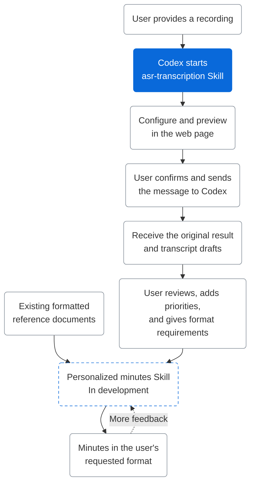

# MemoFlow

[中文](README.md) | English

> MemoFlow is a set of Codex Skills for interactive recording transcription and self-learning minutes generation.

[](https://github.com/hx101700/memoflow/releases/latest) [](LICENSE) [](https://github.com/hx101700/memoflow/releases/latest)

> **Platform: the current version supports Windows 10/11 x64 only.**

MemoFlow is a set of Skills for interactive recording transcription and self-learning minutes generation, designed for meeting transcription, content production, and call analysis. You provide a recording, choose the options you need, and hand the confirmed settings to Codex. The Skill calls Alibaba Cloud Model Studio's ASR service and produces transcript drafts in Word, Excel, and Markdown. Later, MemoFlow will learn from reviewed transcripts, feedback, and formatted reference minutes to generate polished minutes that follow your working style.


## About MemoFlow

Many recording tools provide unstructured text, leaving users to replay the audio, correct names and technical terms, identify speakers, and copy the result into their own document templates. Longer recordings, more speakers, and specific formatting requirements make this work slower and increase the chance of losing context.

MemoFlow first focuses on clear recognition and the delivery of transcript drafts, then aims to learn users' priorities, wording, and document formats. Users review settings in an interactive page; Codex prepares the environment, manages authentication, runs the task, and delivers the files, while Alibaba Cloud Model Studio handles speech recognition. Users can avoid assembling commands by hand and repeatedly adding full transcripts to the conversation, saving context and time.

Codex can understand context, organize multi-step tasks, and continue working with files. A transcription workflow can call a general multilingual model such as [Whisper](https://github.com/openai/whisper), whose performance varies across languages. Chinese dialects, names, product terminology, speaker identification, and context can still require substantial manual review.

MemoFlow uses [Qwen-Audio-3.1-ASR-Flash-Filetrans](https://help.aliyun.com/en/model-studio/qwen-audio-3-1-asr-flash-filetrans) for speech recognition. Alibaba Cloud describes it as a model for meeting transcription, content production, and call analysis, with multilingual and Chinese dialect recognition, hotwords, context enhancement, speaker diarization, punctuation prediction, and text normalization. Qwen recognizes the recording; Codex connects the configuration page, authentication, task execution, and file delivery, making long recordings easier to review and process further.

Personalized minutes generation will also use Codex's context understanding and task orchestration. It will read reviewed transcripts, format examples, priorities, and feedback to learn the user's wording and layout, then generate minutes in the requested format.

The project is organized around two Skills:

| Skill | Capability | Status |
| --- | --- | --- |
| `asr-transcription` | Choose a recording in the interactive page, configure the language, speaker diarization, hotwords, context, and save locations, then let Codex call Model Studio for non-real-time file transcription. The workflow keeps the original JSON and creates timestamped Word, Excel, and Markdown transcript drafts with speaker labels when enabled. | **Available** |
| Personalized minutes generation | Learn structure, information priorities, wording, and layout from reviewed transcripts, focus requirements, formatted reference minutes, and user feedback, then generate minutes in the requested format. Confirmed edits and feedback will improve future output. | **In development** |

<details>
<summary>View the full transcription configuration page (demo data)</summary>


</details>



## Install

Before using MemoFlow, [create an Alibaba Cloud account](https://help.aliyun.com/zh/account/step-1-register-an-alibaba-cloud-account) and follow the [Model Studio setup guide](https://help.aliyun.com/en/model-studio/first-api-call-to-qwen).

1. Download the [v0.1.0 package](https://github.com/hx101700/memoflow/releases/tag/v0.1.0).
2. Send the ZIP to Codex with:

   ```text
   Install this ZIP as the asr-transcription Skill. Read its SKILL.md and prepare the required environment in the current task folder.
   ```

The full package includes Python and Node.js runtimes. The lite package downloads them from official sources during setup. Both packages support Windows 10/11 x64 and require an internet connection for the first dependency installation.

## Use

After installation, tell Codex:

```text
Please transcribe this recording.
```

Codex opens the local configuration page. Choose the recording and recognition settings, open the preview, choose “Copy for Codex”, and send the confirmation message back to the conversation.

**Review and confirm**


**After handing the task to Codex**


The web page screenshots above use demo data. They show the Chinese interface; the page also supports English.

## Help and contribute

- [Usage guide](https://github.com/hx101700/memoflow/blob/master/skills/asr-transcription/references/usage.md): installation, authentication, page workflow, and upgrades.
- [Troubleshooting](https://github.com/hx101700/memoflow/blob/master/skills/asr-transcription/references/errors.md): installation, login, session, and transcription issues.
- [Report a problem](https://github.com/hx101700/memoflow/issues): include your OS, package, steps, and a redacted error.
- [Discuss a use case](https://github.com/hx101700/memoflow/discussions): share workflows, formats, and stage-two needs.
- [Support](https://github.com/hx101700/memoflow/blob/master/SUPPORT.md): choose the right Issue, Discussion, or documentation entry point.
- [Contributing](https://github.com/hx101700/memoflow/blob/master/CONTRIBUTING.md): read this before changing code, docs, or examples.

Never post API keys, login URLs, transcript content, or private local paths in an Issue, Discussion, or screenshot.

## Related links

| Resource | Links |
| --- | --- |
| Alibaba Cloud Model Studio | [Console](https://bailian.console.aliyun.com/) · [Documentation](https://help.aliyun.com/en/model-studio/) |
| BL CLI | [Official site](https://bailian.console.aliyun.com/cli) · [GitHub](https://github.com/modelstudioai/cli) |
| Qwen-Audio 3.1 | [Model overview](https://help.aliyun.com/en/model-studio/asr-model) |
| Recognition accuracy | [Hotwords and context](https://help.aliyun.com/en/model-studio/improve-asr-accuracy) |
| MemoFlow | [Releases](https://github.com/hx101700/memoflow/releases/latest) · [Development docs](https://github.com/hx101700/memoflow/blob/master/doc/README.md) |

Licensed under [Apache-2.0](LICENSE).
