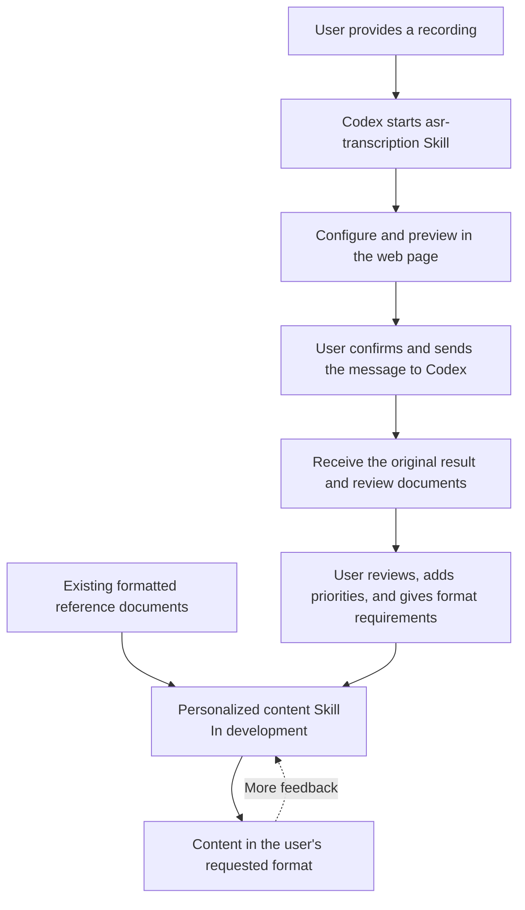

# MemoFlow

[中文](README.md) | English

> MemoFlow is an interactive Codex Skill for audio transcription and self-learning content generation.

[](https://github.com/hx101700/memoflow/releases/latest) [](LICENSE) [](https://github.com/hx101700/memoflow/releases/latest)

> **Platform: the current version supports Windows 10/11 x64 only.**

MemoFlow is an interactive voice transcription and self-learning minutes-generation Skill for meeting transcription, content production, and call analysis. You provide a recording, choose the options you need, and hand the confirmed settings to Codex. The Skill calls Alibaba Cloud Model Studio's ASR service and produces review documents in Word, Excel, and Markdown. Later, MemoFlow will learn from reviewed transcripts, feedback, and formatted reference documents to generate polished content that follows your working style.

## What it includes

MemoFlow is planned as two cooperating Skills:

| Skill | Capability | Status |
| --- | --- | --- |
| `asr-transcription` | Choose a recording in the interactive page, configure the language, speaker diarization, hotwords, context, and output folders, then let Codex call Model Studio for non-real-time file transcription. The workflow keeps the original result and creates timestamped, speaker-aware Word, Excel, and Markdown review documents. | **Available** |
| Personalized content generation | Learn content structure, information priorities, wording, and layout from reviewed transcripts, focus requirements, formatted reference documents, and user feedback, then generate content in the requested format. | **In development** |



## Install

Before using MemoFlow, [create an Alibaba Cloud account](https://help.aliyun.com/zh/account/step-1-register-an-alibaba-cloud-account) and follow the [Model Studio setup guide](https://help.aliyun.com/en/model-studio/first-api-call-to-qwen).

1. Download the [v0.1.0 package](https://github.com/hx101700/memoflow/releases/tag/v0.1.0).
2. Send the ZIP to Codex with:

   ```text
   Install this ZIP as the asr-transcription Skill. Read its SKILL.md and prepare the required environment in the current task folder.
   ```

The full package includes Python and Node.js runtimes. The lite package downloads them from official sources during setup. Both packages support Windows 10/11 x64 and require an internet connection for the first dependency installation.

## Use

After installation, tell Codex:

```text
Please transcribe this recording.
```

Codex opens the local configuration page. Choose the recording and recognition settings, open the preview, choose “Copy for Codex”, and send the confirmation message back to the conversation.

## Help and contribute

- [Usage guide](skills/asr-transcription/references/usage.md): installation, authentication, page workflow, and upgrades.
- [Troubleshooting](skills/asr-transcription/references/errors.md): installation, login, session, and transcription issues.
- [Report a problem](https://github.com/hx101700/memoflow/issues): include your OS, package, steps, and a redacted error.
- [Discuss a use case](https://github.com/hx101700/memoflow/discussions): share workflows, formats, and stage-two needs.
- [Support](SUPPORT.md): choose the right Issue, Discussion, or documentation entry point.
- [Contributing](CONTRIBUTING.md): read this before changing code, docs, or examples.

Never post API keys, login URLs, transcript content, or private local paths in an Issue, Discussion, or screenshot.

## Related links

| Resource | Links |
| --- | --- |
| Alibaba Cloud Model Studio | [Console](https://bailian.console.aliyun.com/) · [Documentation](https://help.aliyun.com/en/model-studio/) |
| BL CLI | [Official site](https://bailian.console.aliyun.com/cli) · [GitHub](https://github.com/modelstudioai/cli) |
| Qwen-Audio 3.1 | [Model overview](https://help.aliyun.com/en/model-studio/asr-model) |
| Recognition accuracy | [Hotwords and context](https://help.aliyun.com/en/model-studio/improve-asr-accuracy) |
| MemoFlow | [Releases](https://github.com/hx101700/memoflow/releases/latest) · [Development docs](doc/README.md) |

Licensed under [Apache-2.0](LICENSE).
