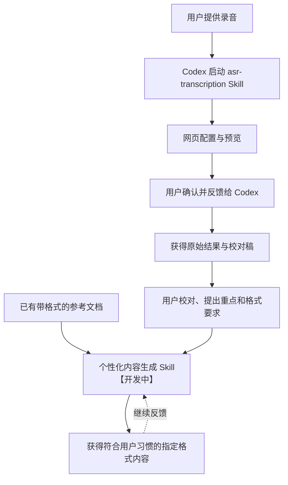

# MemoFlow

中文 | [English](README.en.md)

> MemoFlow 是一套面向 Codex 的交互式语音转写与自学习纪要生成 Skill。

[](https://github.com/hx101700/memoflow/releases/latest) [](LICENSE) [](https://github.com/hx101700/memoflow/releases/latest)

MemoFlow 是一套面向会议转写、内容生产与通话分析等场景的交互式语音转写与自学习纪要生成 Skill。用户提供录制好的音频，按需开启功能并确认设置后，即可交由 Codex 调用阿里云百炼的 ASR 模型，生成 Word、Excel、Markdown 三种格式的校对稿。后续，MemoFlow 将借助 LLM，从用户的校对稿、反馈和已有的带格式纪要文档中持续学习，生成符合用户习惯、排版规整、可直接交付的新纪要。

## 具体介绍

很多录音工具只能给出一段未经整理的文字，用户还要自己反复回听、修正人名和专业术语、区分发言人，再把内容复制到自己的文档模板中。录音越长、参与者越多、格式要求越明确，这个过程越耗时，也越容易丢失上下文。

MemoFlow 的方向是先把“听清、识准、交付校对稿”做好，再逐步学习用户的重点、表达方式和文档格式。交互式网页负责让用户在执行前看清并确认设置，Codex 负责组织环境、认证、调用和文件交付，阿里云百炼负责语音识别；这样用户不需要手动拼接命令，也不需要把完整转写内容反复放进对话中。

Codex 擅长理解上下文、组织多步任务和继续处理文件，但语音识别不是它的核心能力。一般语音工作流会使用 [Whisper](https://github.com/openai/whisper)；Whisper 是通用多语种识别模型，但不同语言的识别表现存在差异，在中文方言、人名、产品术语、说话人区分和上下文理解这些场景中，仍可能需要较多人工校对。

MemoFlow 选择阿里云百炼的 [Qwen-Audio-3.1-ASR-Flash-Filetrans](https://help.aliyun.com/zh/model-studio/qwen-audio-3-1-asr-flash-filetrans) 作为语音识别引擎。根据阿里云官方模型说明，它面向会议转写、内容生产和通话分析等场景，支持多语种与多地区中文方言识别，并提供高精度转写、热词与上下文增强、说话人分离、标点预测和文本规范化能力，适合长音频非实时转写。Qwen 负责把语音识别清楚，Codex 负责把网页交互、认证、任务执行和结果交付串起来；两者结合，用来处理语音听不清、术语识别不准、多人内容难整理和结果难继续加工的问题。

后续的个性化内容生成也会依托 Codex 的上下文理解和任务编排能力：它读取转写稿、格式范例、重点要求和用户反馈，逐步学习用户的表达与排版方式，再生成指定格式的内容。

先拆开“转写”和“个性化内容生成”，是为了让每一阶段都有清晰的输入和输出：第一阶段交付稳定、可检查的转写结果，第二阶段再以用户校对后的内容和格式范例为依据学习。当前项目主要由以下两个 Skill 组成：

| Skill | 能力 | 状态 |
| --- | --- | --- |
| `asr-transcription` | 用户在交互式网页中选择录音，设置识别语言、说话人区分、热词、上下文和保存位置；Codex 接收用户确认后调用阿里云百炼完成长音频非实时转写，保留原始 JSON，并生成带时间戳、可区分发言人的 Word、Excel、Markdown 校对稿。 | **已完成** |
| 个性化内容生成 | 以用户校对后的转写稿为基础，结合重点要求和已有的带格式纪要文档，学习内容结构、信息取舍、表达方式与排版习惯，生成符合指定格式的新纪要；将用户确认的修改和反馈用于后续生成，持续完善个性化输出。 | **开发中** |



## 安装

使用前请准备[阿里云账号](https://help.aliyun.com/zh/account/step-1-register-an-alibaba-cloud-account)，并按[百炼官方指引](https://help.aliyun.com/zh/model-studio/first-api-call-to-qwen)完成服务准备。

1. 下载 [v0.1.2 安装包](https://github.com/hx101700/memoflow/releases/tag/v0.1.2)。
2. 把 ZIP 和下面这句话一起发给 Codex：

   ```text
   请将这个 ZIP 安装为 asr-transcription Skill，阅读其中的 SKILL.md，并按说明在当前任务文件夹准备运行环境。
   ```

完整包包含 Python 和 Node.js 运行时；轻量包首次安装时从官方来源下载运行时。两种包都支持 Windows 10/11 x64，首次安装依赖联网。

## 使用

安装完成后，告诉 Codex：

   ```text
   帮我转写这段录音。
   ```

Codex 会打开本机配置网页，请在网页中完成录音和识别设置，进入预览页后点击“复制给 Codex”，再将确认消息发回原对话。

## 帮助与参与

- [使用指南](skills/asr-transcription/references/usage.md)：安装、认证、网页操作和升级。
- [错误说明](skills/asr-transcription/references/errors.md)：登录、安装、会话和转写问题。
- [提交问题](https://github.com/hx101700/memoflow/issues)：请附操作系统、安装包、复现步骤和脱敏错误。
- [功能讨论](https://github.com/hx101700/memoflow/discussions)：分享使用场景、输出格式和第二阶段需求。
- [支持说明](SUPPORT.md)：选择 Issue、Discussion 或文档入口。
- [贡献指南](CONTRIBUTING.md)：提交代码、文档和示例前请先阅读。

请不要在 Issue、Discussion 或截图中提交 API Key、登录链接、录音原文或私人路径。

## 相关链接

| 资源 | 链接 |
| --- | --- |
| 阿里云百炼 | [控制台](https://bailian.console.aliyun.com/) · [官方文档](https://help.aliyun.com/zh/model-studio/) |
| 百炼 CLI | [官方主页](https://bailian.console.aliyun.com/cli) · [GitHub](https://github.com/modelstudioai/cli) |
| Qwen-Audio 3.1 | [模型说明](https://help.aliyun.com/zh/model-studio/asr-model) |
| 识别精度增强 | [热词与上下文说明](https://help.aliyun.com/zh/model-studio/improve-asr-accuracy) |
| MemoFlow | [Release](https://github.com/hx101700/memoflow/releases/latest) · [开发文档](doc/README.md) |

本项目采用 [Apache-2.0](LICENSE) 许可证。
