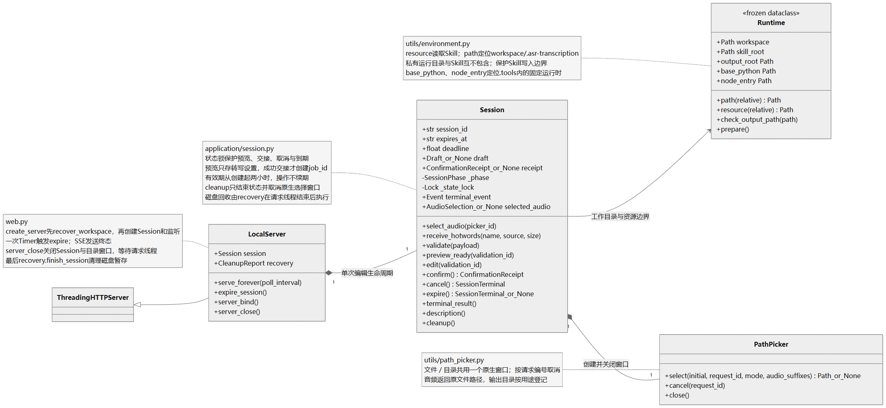
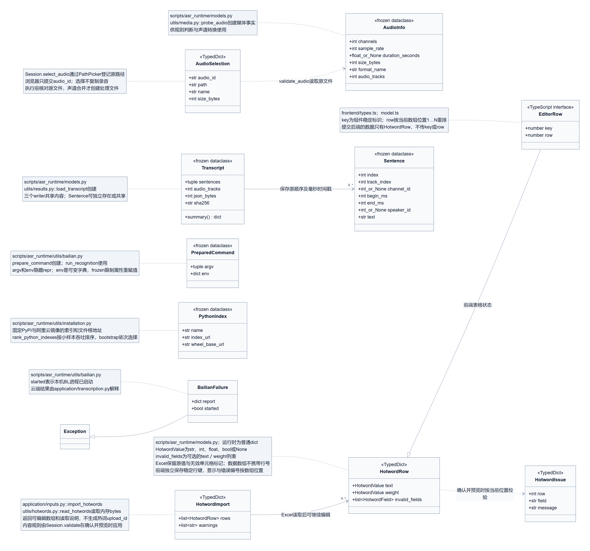
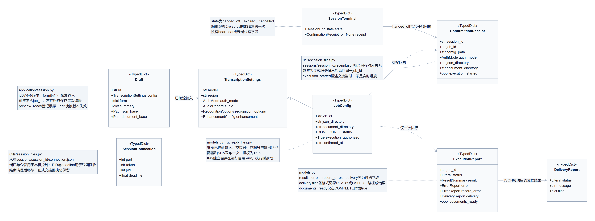
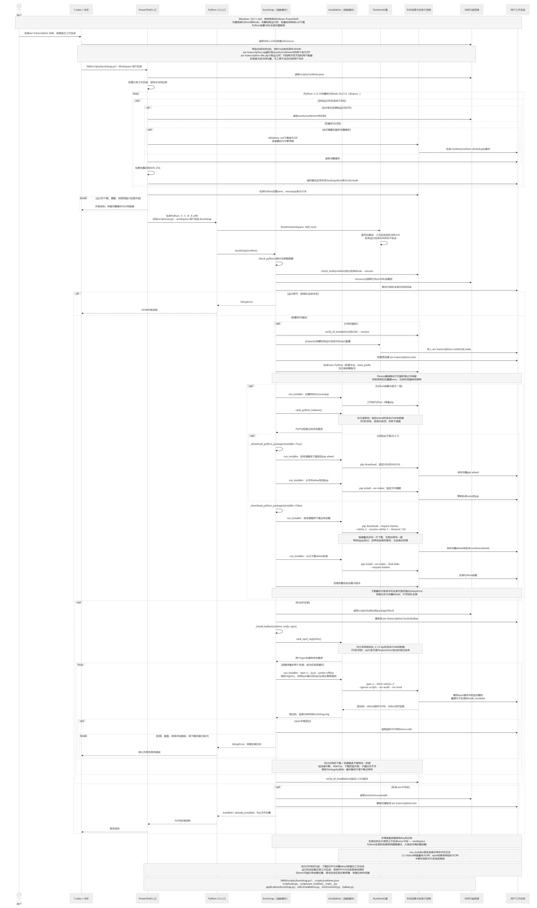
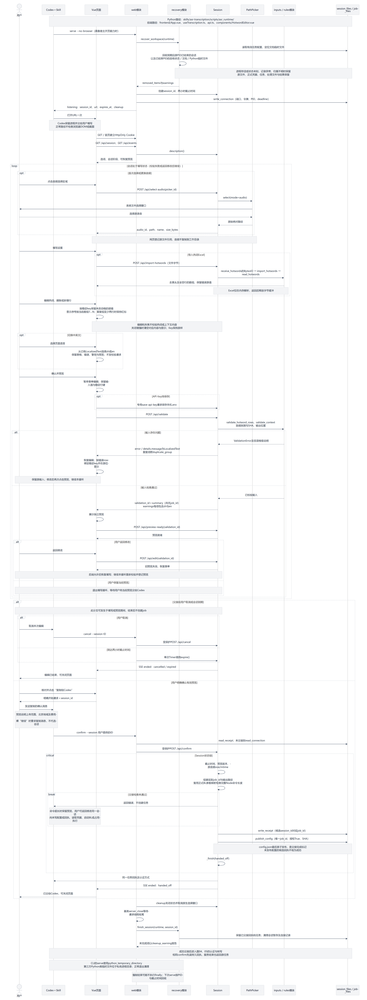
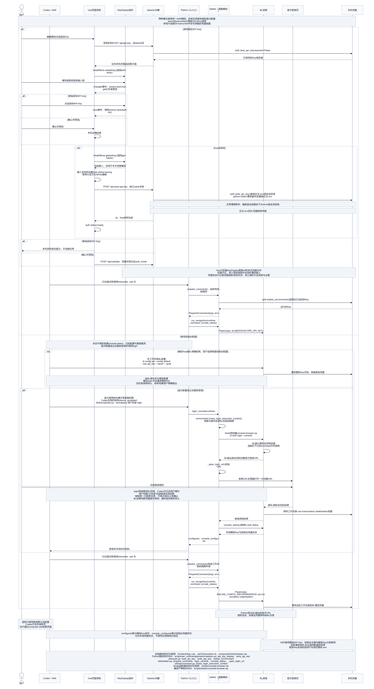
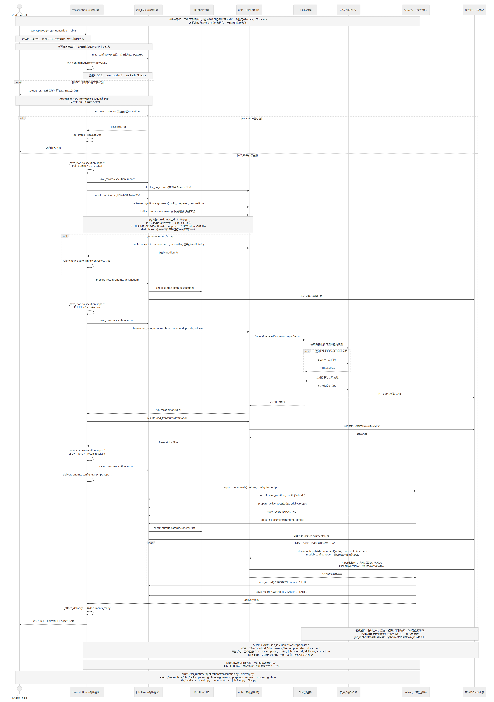
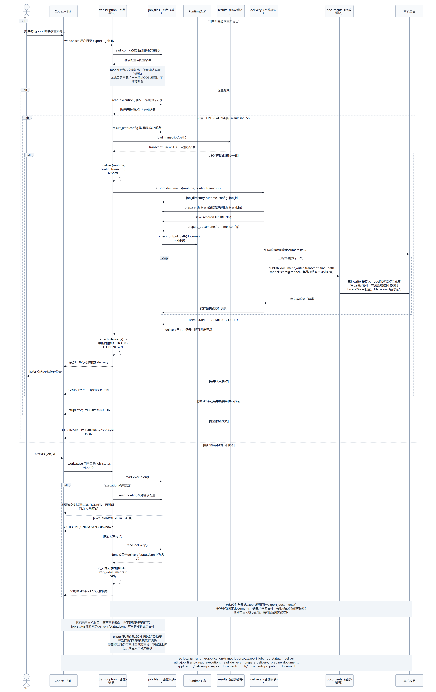
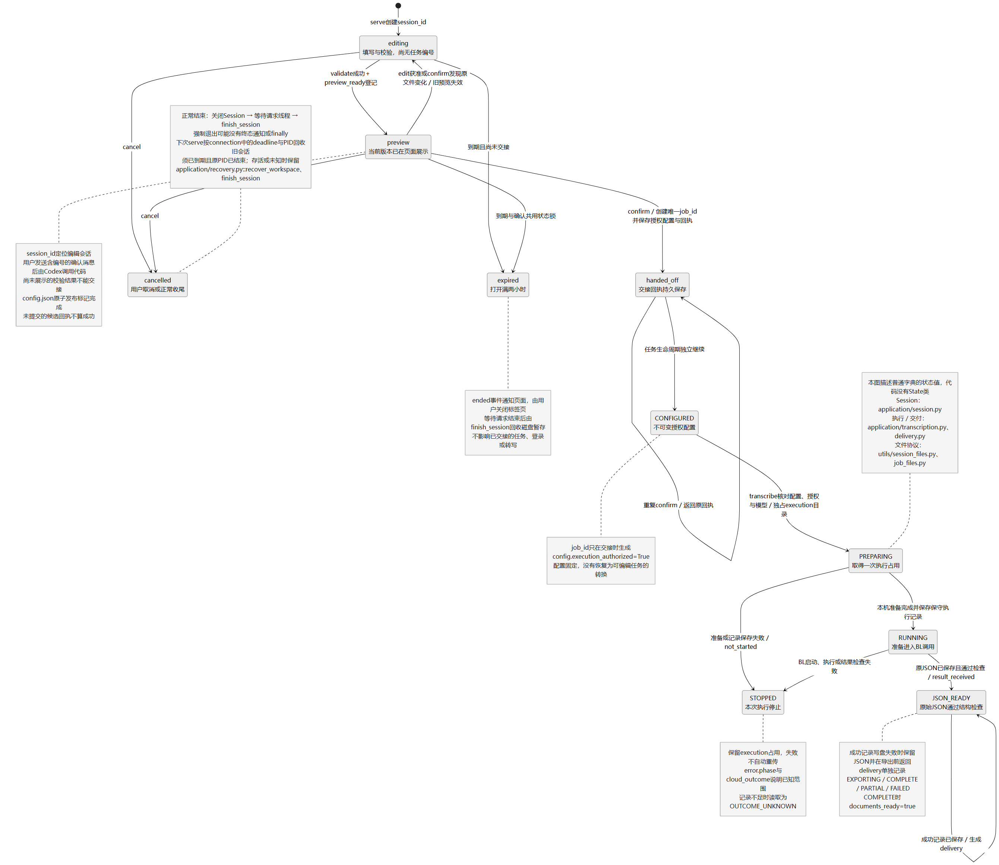
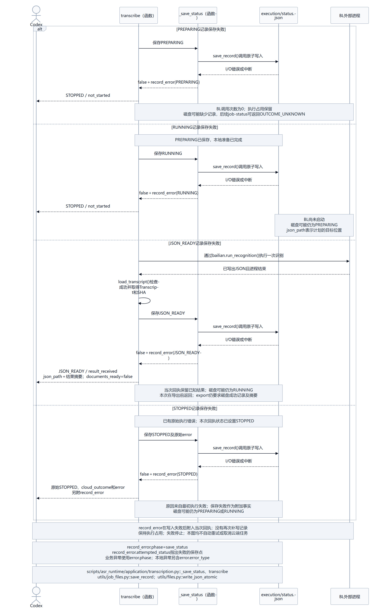

# UML 设计视图

本页描述第一阶段 asr-transcription Skill 的实际对象、调用和状态。第二阶段会议纪要与反馈学习尚未实现，不在图中虚构服务。

核对日期：2026-10-05。Python 图中 application、utils 等位置相对于 skills/asr-transcription/scripts/asr_runtime/；frontend 路径相对于仓库根。函数模块使用生命线，具有生命周期的 Session、Runtime、PathPicker 使用对象；状态图描述协议中的状态字符串。

当前协议区分编辑会话与执行任务：网页填写和预览不产生 job_id，用户发送含 session_id 的确认消息后才交接。预览展示登记、返回修改、两小时期限及一次结束通知见图 03、07；交接后的认证与执行见图 04、05。持久回执使相同会话恢复同一个任务，网页服务结束不影响执行。

图 03 将填写和预览画为可重复的循环：校验失败或返回修改后，须重新校验并登记当前预览；取消和到期在交接前结束编辑，不产生任务。交接写入配置前按实际任务路径检查完整 Windows 命令，超限保留预览供修改。图 04 的单独凭据保存结束于取消编辑会话，只有已成功交接的任务才进入转写。

图 01A、03、07 还描述关闭与下次开页回收：Session 结束后等请求线程，再清理磁盘；强制退出的旧会话按 PID 与原截止时间回收，保留任务和结果。图 01C 的连接记录给出归属依据，图 04 说明 Key 先在会话目录暂存再替换正式文件。

图 01B 区分数组中的热词单元格、前端稳定行键和显示序号；导入回执只含数组和读取说明，内容问题由预览校验产生。错误绑定稳定行键，编辑或删除只移除当前格或行提示；重复组剩余至少两行时继续标红，仅剩一行时清除重复提示。错误与警告一次返回双语文本，切换语言保留页面状态；关闭增强开关清空相应内容，API Key 保持原样，见图 03。

图 01C 区分预览设置、已授权配置、交接回执与执行结果。图 02 描述依赖安装，图 06、08 描述本地重导和执行记录失败，这些职责没有迁移到编辑会话。

图 02 先由 Windows PowerShell 准备私有 Python/Node，再调用原有 Python 安装用例；图 01A 的 Runtime 提供本机运行时绝对路径。完整包附 `assets/runtimes` 下的原始官方 ZIP，轻量包从官方来源下载或复用工作目录缓存。两者使用相同固定摘要，实际运行时均解压到用户工作目录，包内资源保持只读。

Python 依赖与 BL 分别比较各自两个固定下载来源。Python 由 pip 处理有限续传；BL 由 npm 处理连接重试、缓存和完整性校验，仅在已识别的下载错误后换源。本机安装、权限及锁错误停止；安装恢复不改变识别任务的一次执行约束。

编辑时的右侧 SettingsSummary.vue 仅由当前表单派生显示，不产生新的 HTTP 请求或预览版本；正式预览与交接仍按图 03、07 执行。校验期间暂时禁用表单编辑，保留全部输入值；明确重查时替换旧诊断，连接不可用时统一为一个结果页。

源稿为 Mermaid，PNG 供直接阅读。图和开发文档保留在仓库；两个发行包共用运行代码、参考资料和最新版双语 README，完整包另含两个官方运行时 ZIP。图稿及实际渲染验证见 [ACCEPTANCE](ACCEPTANCE.md)。

| 视图 | 图像 | 可编辑源稿 |
| --- | --- | --- |
| 01A 对象职责与依赖 | [查看](uml/01-classes.png) | [源码](uml/01-classes.mmd) |
| 01B 共享数据与进程契约 | [查看](uml/01b-data.png) | [源码](uml/01b-data.mmd) |
| 01C 确认配置与交付回执 | [查看](uml/01c-protocol.png) | [源码](uml/01c-protocol.mmd) |
| 02 准备工作目录 | [查看](uml/02-install.png) | [源码](uml/02-install.mmd) |
| 03 本机配置 | [查看](uml/03-configure.png) | [源码](uml/03-configure.mmd) |
| 04 凭据来源与登录 | [查看](uml/04-auth.png) | [源码](uml/04-auth.mmd) |
| 05 转写与交付 | [查看](uml/05-transcribe.png) | [源码](uml/05-transcribe.mmd) |
| 06 重新导出与状态查询 | [查看](uml/06-export.png) | [源码](uml/06-export.mmd) |
| 07 本地状态 | [查看](uml/07-state.png) | [源码](uml/07-state.mmd) |
| 08 记录保存失败 | [查看](uml/08-failure.png) | [源码](uml/08-failure.mmd) |

## 01A 对象职责与依赖

## 01B 共享数据与进程契约

## 01C 确认配置与交付回执

## 02 准备工作目录

## 03 本机配置

## 04 凭据来源与登录

## 05 转写与交付

## 06 重新导出与状态查询

## 07 本地状态

## 08 记录保存失败

